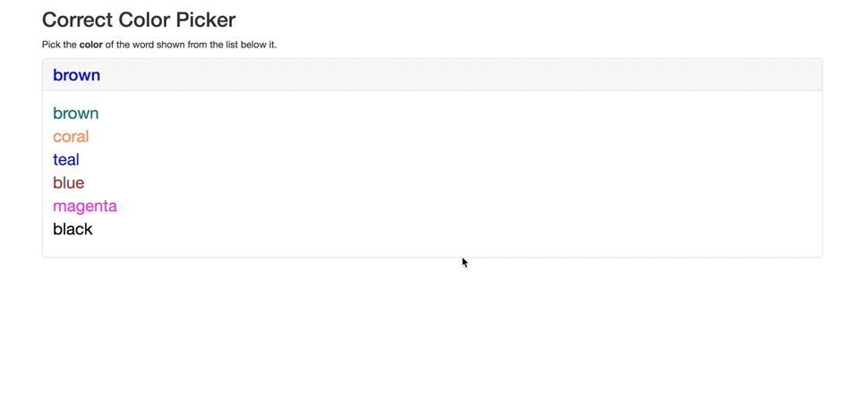

# color-picker

* For this activity, you'll be creating a "correct color" game.

* The game generate a random color string (ie, "green" or "blue") that is displayed in a random color. We'll cause this the current color.

* It also generate a list of random color strings that are also displayed in random colors. We'll call this the color list.

* The user must click the *name* of the color in the color list that matches the *color* of the current color.

* Make an alert telling the user whether they chose correct or incorrect.

* After the alert, the game should reset.

* Checkout the below gifs to see how the game should work.

